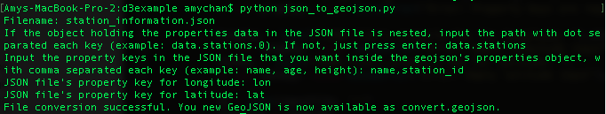

# JSON to GeoJSON

## Introduction
JSON to GEOJSON is an open source command line tool built in Python 3 to convert JSON to GeoJSON file.

It takes the input of: JSON file path, dot notation path of properties object if nested, keys of the properties wanted in final GeoJSON file, and properties key containing longitude-latitude values (used for the GeoJSON's coordinate property). The geometry primitives type is currently set to Point.

The program outputs a "convert.geojson" file, which holds data in GeoJSON format according to [RFC7946](https://tools.ietf.org/html/rfc7946). The features are contained by a FeatureCollection objects.

Visit [From D3 Meetup, To Jam Session, To Writing A JSON to GeoJSON Convertor](http://www.craftplustech.com/blog/?p=1909) to read my post on how it got started and what I did.

## Usage

First clone the tool repo where you want the output to be:
```
git clone https://github.com/amychan331/json-to-geojson.git
```
or
```
git clone git@github.com:amychan331/json-to-geojson.git
```

Enter into the project folder:
```
cd json-to-geojson
```

Then start the tool:
```
python3 json_to_geojson.py
```

The command line should then output the what information you should input. Note that JSON to GeoJSON reads file based on input, then outputs data into current directory, so please adjust permissions accordingly.


## Screenshot
<kbd></kbd>
<kbd></kbd>